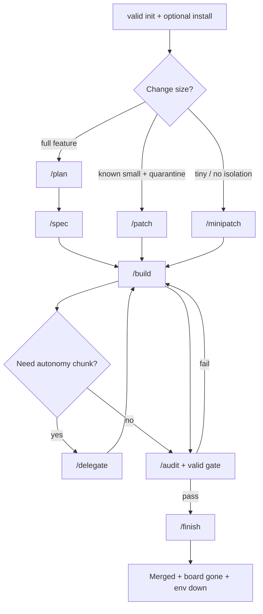
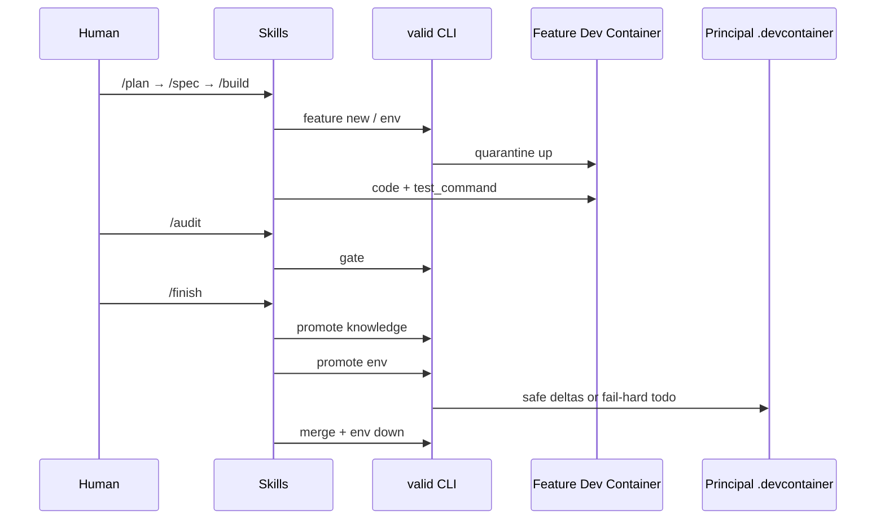
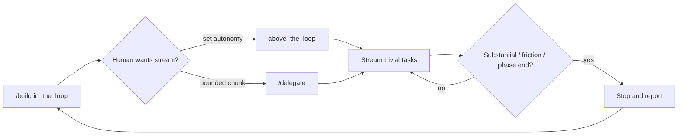

# VALID

**Visual Agentic Loop for Isolated Development**

VALID is a small, **AI-agnostic** toolkit for shipping software features with coding agents — without letting them trash your host, your main Dev Container, or your shared databases. The method lives in Markdown **skills** and **agents**; a tiny Go CLI does deterministic plumbing (worktrees, quarantine envs, gates, promote, merge); and a **dashboard** gives you a visual read on how far the AI has actually gotten. Your editor of choice is optional wiring, not the product.

---

## Table of contents

1. [Target](#target)
2. [Why AI-agnostic](#why-ai-agnostic-and-why-that-matters-now)
3. [Problems VALID solves](#problems-valid-solves)
4. [Built on Dev Containers](#built-on-dev-containers-not-a-custom-runtime)
5. [Mental model (four layers)](#mental-model-four-layers)
6. [What you get](#what-you-get)
7. [Requirements](#requirements)
8. [Install the binary](#install-the-binary)
9. [Set up a consumer project](#set-up-a-consumer-project)
10. [Usage flows](#usage-flows)
11. [Board + dashboard (visual progress)](#board--dashboard-visual-progress)
12. [Autonomy (in / above the loop)](#autonomy-in--above-the-loop)
13. [MCP and project scripts](#mcp-and-project-scripts)
14. [IDE packages](#ide-packages)
15. [CLI reference](#cli-reference)
16. [Troubleshooting](#troubleshooting)

---

## Target

Teams (or solo developers) who already use AI coding agents and need:

- a **repeatable method** (plan → spec → build → audit → finish), not a one-off chat ritual
- **isolation** so experiments do not pollute the machine or the stable project environment
- a **durable contract of progress** the model must keep honest (ACs, tasks, TDD evidence, Mermaid) — and a **visual dashboard** so you can see implementation state without digging through chat
- **proof of done** that is mechanical (AC↔task coverage + real test runs), not vibes
- **searchable project knowledge** that survives the chat window (RAG over `.valid/knowledge/`)
- freedom to **change models and IDEs** without rewriting the workflow

VALID is **meant** to work well inside VS Code and forks such as Cursor (skills panels, MCP, project rules) — and equally on Claude Code, OpenCode, Codex, or a plain terminal + any agent that can read Markdown and call a CLI. None of those hosts are required. If you can run `valid` and open a chat that follows `.valid/skills/`, you can use VALID.

---

## Why AI-agnostic (and why that matters now)

AI tooling churns fast: new models, new IDEs, new “agent” products every month. A workflow that only exists as a proprietary plugin dies when you switch. VALID keeps the **method and the contract** in your repo (skills, agents, board JSON, knowledge corpus) and keeps the **CLI** as boring plumbing. Swap Cursor for Claude Code, or GPT for Claude — the loop stays the same. IDE packages under `packages/` are thin adapters; `valid install` copies them. The product is not the adapter.

---

## Problems VALID solves

AI coding agents are powerful and also reliably create expensive messes:

| Problem | What goes wrong without VALID | What VALID does |
|---------|-------------------------------|-----------------|
| **Host pollution** | Global `npm i -g`, apt packages, toolchain upgrades, caches on your daily machine | Feature work runs in a **quarantined Dev Container** on a git worktree |
| **Shared env drift** | Agents edit the project’s principal `.devcontainer/` / stack before the change is proven | Feature DC only under `.valid/worktrees/<slug>/`; **promote env** is fail-hard into the existing principal DC |
| **Dirty data stores** | Tests and migrations hit the primary DB and leave it inconsistent | Feature DB **off by default**; optional recipe; soft isolation warnings |
| **Opaque “done”** | “It works” with no ACs, no coverage, no suite evidence | Dual **gate**: every AC covered by a task **and** `test_command` executed green |
| **Knowledge amnesia** | Decisions die in chat | Fragmented knowledge + MCP RAG; promote only what clears a high bar |
| **IDE / vendor lock-in** | Workflow lives only in one plugin | Skills + CLI + optional adapters; terminal-first always works |
| **Autonomous chaos** | Agent streams for an hour and invents scope | Default **in the loop**; optional **above the loop** + **delegate** agent for bounded chunks |

---

## Built on Dev Containers (not a custom runtime)

VALID’s isolation story is deliberately grounded in the open **[Dev Containers](https://containers.dev/)** ecosystem (Docker + `devcontainer.json`, and optionally the [Dev Containers CLI](https://github.com/devcontainers/cli)). We did not invent a parallel “agent sandbox” format.

**Why Dev Containers**

- They already solve “reproducible, containerized development environments” for VS Code, Cursor, Codespaces, and CLI workflows.
- Teams often **already** have a principal `.devcontainer/` — VALID treats that as sacred and never invents one for you.
- The same JSON/Dockerfile vocabulary your humans use for day-to-day work is what the agent uses in quarantine, so promote-back is reviewable, not magical.

**How VALID uses them**

| Layer | Where | Role |
|-------|--------|------|
| **Principal Dev Container** | Project `.devcontainer/` (yours) | Stable daily environment. VALID **never creates** this; `promote env` only merges safe deltas into it (fail hard on doubt). |
| **Feature quarantine DC** | `.valid/worktrees/<slug>/.devcontainer/` | Ephemeral env for one feature: cloned from the principal when present, otherwise a VALID quarantine template (language via `BASE_IMAGE`). Unique container name (`valid-<slug>`), ports remapped so they do not steal the principal’s host ports. |
| **Git worktree** | `.valid/worktrees/<slug>/` | File/branch isolation (`feature/<slug>`) cut from the principal folder’s current branch — paired with the feature DC so code + runtime stay together. |
| **Docker-outside-of-Docker** | Feature DC `features` / Docker socket | Lets the feature env use Docker when your stack needs it, without baking a second opaque runtime into VALID. |

**Soft by design if Docker/Dev Containers CLI is missing:** VALID still scaffolds the board and worktree and records an isolation warning. Full quarantine needs Docker + Dev Containers; `minipatch` deliberately skips worktree/DC for tiny edits (same gates, no quarantine).

So: VALID is a **method + board + plumbing** layer **on top of** Dev Container tech — not a replacement for it.

---

## Mental model (four layers)

Do not confuse these:

| Layer | What it is | What it is not |
|-------|------------|----------------|
| **Skill** | Markdown procedure under `.valid/skills/` you invoke in chat (`/plan`, `/build`, …). Orchestrates dialogue, **edits the board**, and decides when to call CLI/MCP/agents. | Not a CLI subcommand. Not auto-run by the model (`disable-model-invocation: true`). |
| **Agent** | Role prompt under `.valid/agents/` (`interviewer`, `developer`, `reviewer`, `delegate`). A skill may invoke it for focused work. | Not the full method by itself. |
| **CLI** (`valid`) | Deterministic scaffolding: feature/worktree/DC, gate, promote, merge, env, dashboard, install. | Does not dialog. There is no product UX of `valid plan` / `valid build`. |
| **MCP** (`valid mcp`) | Knowledge RAG + optional project script tools. | Never mutates boards / TDD / ACs. |

```text
You (human)
  └─► Skill (e.g. /build)
        ├─► Agent role (developer / delegate / …)
        ├─► edits ──► .valid/features/<slug>/ (progress contract)
        ├─► CLI valid …  ──► worktree / DC / gate / promote / merge / dashboard
        └─► MCP tools    ──► .valid/knowledge/** + .valid/scripts/**
```

Open `valid dashboard --feature <slug>` anytime to **see** that progress visually (lifecycle, autonomy, ACs, tasks, tests, Mermaid, gate).

---

## What you get

| Piece | Role |
|-------|------|
| **Skills** | `plan`, `spec`, `build`, `audit`, `finish`, `patch`, `minipatch`, `delegate` |
| **Agents** | `interviewer`, `developer`, `reviewer`, `delegate` |
| **Autonomy** | Board `autonomy`: `in_the_loop` (default) \| `above_the_loop` |
| **Board + dashboard** | Machine-readable progress under `.valid/features/<slug>/`; **`valid dashboard`** is the visual way to inspect AI implementation state |
| **CLI** | Scaffold, gate, promote, merge, env, dashboard, install |
| **MCP** | Knowledge RAG + project scripts |
| **IDE install** | Optional adapters for Cursor / Claude Code / OpenCode / Codex |

Language-agnostic: set `test_command` (`npm test`, `go test ./...`, `pytest`, …). VALID records results; it does not own your runner.

---

## Requirements

- Go 1.22+ (to build VALID)
- Git
- Optional: Docker + [Dev Containers CLI](https://github.com/devcontainers/cli)
- Optional: VS Code / Cursor / Claude Code / OpenCode / Codex — **not required**

---

## Install the binary

```bash
git clone <this-repo>
cd VALID
make build
export PATH="$PWD/bin:$PATH"
valid --help
```

---

## Set up a consumer project

```bash
cd /path/to/your-project
valid init
# optional IDE wiring — skip if you only use terminal + any agent:
valid install cursor          # or: claude | opencode | codex | all
```

1. **`valid init`** — seeds `.valid/` (config, skills, agents, knowledge, scripts).
2. **`valid install <ide>`** — publishes skills into that host’s skill tree + MCP/rules. Re-run after upgrading VALID.

Edit `.valid/config.json` at least:

```json
{
  "test_command": "npm test",
  "dashboard_port": 7432,
  "mcp_http_port": 7433,
  "feature_dashboard_port": 0,
  "feature_port_offset": 100
}
```

| Key | Meaning |
|-----|---------|
| `test_command` | How this repo runs its suite (`valid gate` executes it) |
| `dashboard_port` | `valid dashboard` — visual progress UI (loopback) |
| `mcp_http_port` | `valid mcp --http` |
| `feature_dashboard_port` | Base for feature DC ports (each slug salted); `0` → `dashboard_port + feature_port_offset` |
| `scripts_root` | MCP script nodes (default `.valid/scripts`) |
| `main_devcontainer` | Path to principal DC JSON (default `.devcontainer/devcontainer.json`) |
| `database.enabled` | Default `false` — do not touch the principal DSN from feature work |

---

## Usage flows

Skills are **manual**. Invoke them explicitly in chat (e.g. `/plan`). The model will not auto-pick them.

### Flow map



### A — Day zero (once per repo)

```bash
cd /path/to/your-project
valid init
valid install cursor          # optional
# set test_command in .valid/config.json
# ensure principal .devcontainer/ exists if you want promote env later
```

Then open chat and follow skills under `.valid/skills/` (or the IDE copies from `valid install`).

### B — Full feature (canonical)

Goal: new behaviour with quarantine, ACs, TDD, review, promote, merge.

| Step | You invoke | What happens |
|------|------------|--------------|
| 1 | `/plan my-feature` | Interview → Mermaid how-it-works → `valid feature new` → worktree + feature DC. Board at `.valid/features/my-feature/`. |
| 2 | `/spec` | Measurable `what[]` ACs + `phases[]` (`interviewer`). LLM edits the board. |
| 3 | `/build` | Decisions + tasks with `covers` → TDD in quarantine (`developer`). Default `in_the_loop`. |
| 3b | `/delegate` (optional) | Bounded chunk with `above_the_loop` (`delegate` agent). Same gates. |
| 4 | `/audit` | `reviewer` + `valid gate` (AC↔task **and** live `test_command`). Fix and re-audit if red. |
| 5 | `/finish` | Promote knowledge (sparingly) → fail-hard promote env → merge into recorded principal branch → delete board → tear down env. |

**Plumbing the same path by hand** (skills normally call these):

```bash
valid feature new my-feature --north-star "Users can reset password"
# …agent edits data.json + how-it-works.mmd + code in .valid/worktrees/my-feature/…
valid gate my-feature
valid promote knowledge my-feature
valid promote env my-feature          # fail hard if principal DC missing / opaque delta
valid merge my-feature                # downs container, merges, removes worktree
valid feature delete my-feature       # if board still present
```

**See progress while the agent works** (do not rely on chat alone):

```bash
valid dashboard --feature my-feature
# open http://127.0.0.1:<dashboard_port> — lifecycle, ACs, tasks, tests, Mermaid, gate findings
```

**Abort rules on finish:** if `promote env` fails, **do not** merge and **do not** delete the board. Fix the todo under `workspace/env-promote-todo.md` and re-run.



### C — Patch (small change, still quarantined)

Use when there **is** precedent in code, scope is small, but you still want worktree + DC.

1. `/patch <slug>` — short `what[]` / tasks, then same build → audit → finish discipline as a feature.
2. Same gates: AC coverage + green tests. No relaxed “it’s tiny” escape hatch.

### D — Minipatch (tiny change, no quarantine)

Use for typo-level / obvious one-file fixes when isolation is overkill.

1. `/minipatch <slug>` — ephemeral board, **no** worktree/DC (`isolation_warning` expected).
2. Still: ACs, tasks/`covers`, `test_command` evidence, `valid gate`.
3. Commit on the current branch; no `valid merge` of a feature branch. Delete the board when done (`valid feature delete` or finish path for minipatch).

### E — Above the loop / delegate



```bash
valid board set my-feature --autonomy above_the_loop
# …or invoke /delegate with a phase id / task range…
valid board set my-feature --autonomy in_the_loop
```

Rules: stream **trivial** work only; stop on architecture, new ACs, secrets, failing suite you cannot fix inside the chunk. Delegate never skips audit/finish.

### F — Knowledge + scripts during work

```bash
valid mcp                 # stdio — IDE install points here
# In chat: search_knowledge / get_document / upsert_document
# Plus any tools from .valid/scripts/<id>/meta.json
```

HTTP (loopback + token; scripts off by default):

```bash
export VALID_MCP_TOKEN='long-random-secret'
valid mcp --http --addr 127.0.0.1:7433
```

### G — Which flow should I pick?

| Situation | Flow |
|-----------|------|
| New feature / unclear shape | **B — Full feature** (`/plan` … `/finish`) |
| Small change, want isolation | **C — Patch** |
| Tiny fix, isolation optional | **D — Minipatch** |
| Tired of confirming every trivial task | **E — Delegate / above_the_loop** (still finish with audit) |
| Env delta proved in quarantine | Stay on **B**; let `/finish` promote env (or fail-hard) |

---

## Board + dashboard (visual progress)

Chat is a terrible status page. VALID keeps a **per-feature contract on disk** that the AI must update as it works, and a **dashboard** so you can visually check how far implementation has really gone — without scrolling transcripts or trusting “done” in prose.

**On disk (source of truth the model edits):**

```text
.valid/features/<slug>/
  data.json           # ACs, phases, tasks/covers, TDD, audit, autonomy, env…
  how-it-works.mmd    # Mermaid (required past plan for feature/patch)
  workspace/
    deps-delta.md
    gotchas.md        # optional
    env-promote-todo.md  # written on promote env failure
.valid/worktrees/<slug>/   # git worktree + feature .devcontainer/ (not for minipatch)
```

**On screen (`valid dashboard`):** a loopback HTTP UI that polls the board and shows lifecycle, autonomy, acceptance criteria, tasks, decisions, test evidence, Mermaid how-it-works, and gate findings. That is the intended way to **watch AI implementation progress**.

```bash
valid dashboard --feature my-feature
# http://127.0.0.1:<dashboard_port from config>
```

Important board fields: `north_star`, `what[]`, `phases[]`, `tasks[]` + `covers`, `decisions[]`, `assumptions[]`, `tdd`, `audit`, `environment` (incl. `base_branch`), `autonomy`, `pending_promotions[]`.

The **LLM** is the primary writer of the board files. CLI `board` / `task` / `report` are optional helpers. The **dashboard** is read-only visualization of that state.

---

## Autonomy (in / above the loop)

| Mode | Behaviour |
|------|-----------|
| `in_the_loop` (default) | Human present on **every** task |
| `above_the_loop` | Stream trivial tasks; stop on real decisions / phase boundaries / friction |
| `/delegate` | Skill + `delegate` agent: explicit chunk boundary + stop report |

---

## MCP and project scripts

Each folder with `meta.json` under `.valid/scripts/` becomes its own MCP tool:

```text
.valid/scripts/seed_db/
  meta.json
  run.sh
```

```json
{
  "description": "Seed local DB with fixtures.",
  "command": ["bash", "run.sh"],
  "timeout_sec": 120,
  "cwd": "script",
  "enabled": true
}
```

Reconnect MCP after adding tools. Never use MCP to fake TDD or ACs.

---

## IDE packages

Thin adapters only. Prefer `valid install`. VS Code/Cursor are convenient hosts, not a requirement.

| Package | Wiring |
|---------|--------|
| [`packages/cursor`](packages/cursor/) | MCP + rules + skills tree |
| [`packages/claude-code`](packages/claude-code/) | MCP + `CLAUDE.md` + skills |
| [`packages/opencode`](packages/opencode/) | Config fragment + skills |
| [`packages/codex`](packages/codex/) | MCP TOML + `AGENTS.md` |

```bash
valid install cursor --force
make sync-ide    # when developing VALID itself: packages → embed assets
```

---

## CLI reference

Plumbing only — not the method UX:

```text
valid init
valid install [cursor|claude|opencode|codex|all] [--force] [--link]
valid feature new <slug> [--mode feature|patch|minipatch] [--north-star …] [--no-env]
valid feature delete <slug> [--keep-env]
valid gate <slug> [--trust-board]
valid promote knowledge|env <slug> [--dry-run]
valid merge <slug> [--skip-gate] [--allow-early] [--allow-current-head]
valid env up|down <slug>
valid dashboard --feature <slug>
valid mcp [--http] [--addr 127.0.0.1:7433] [--allow-scripts-http]
valid board set|show <slug> [--autonomy in_the_loop|above_the_loop] …
valid task <slug> <id> …          # optional
valid report <slug> …             # optional
```

---

## Troubleshooting

| Symptom | Likely cause | What to do |
|---------|--------------|------------|
| Gate fails `no_tests` / `tests_not_green` | Suite not run or red | Fix tests; re-run `/audit` (gate executes `test_command`) |
| Gate fails `ac_uncovered` | AC without `tasks[].covers` | Add/fix tasks on the board |
| Gate fails `how_it_works_*` | Missing/stub Mermaid | Author real diagram in `how-it-works.mmd` |
| `isolation_warning` | Outside worktree/DC or `minipatch` | Expected for minipatch; for features prefer worktree |
| Promote env fail-hard | No principal DC / opaque Dockerfile / conflict | Read `workspace/env-promote-todo.md`; fix; re-run — **no merge yet** |
| Merge refused (lifecycle) | Still in `plan`/`spec`/`build` | Finish audit first, or `--allow-early` (dangerous) |
| Merge refused (empty `base_branch`) | Board missing cut-from branch | Fix board or `--allow-current-head` |
| Skills missing in IDE | Install not run / cache | `valid install <ide> --force`; reload MCP |
| Orphan `valid-<slug>` container | Interrupted finish | `valid env down <slug>` or `docker rm -f valid-<slug>` |

---

## License

MIT License
