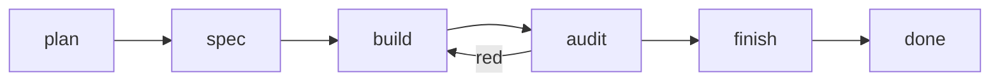
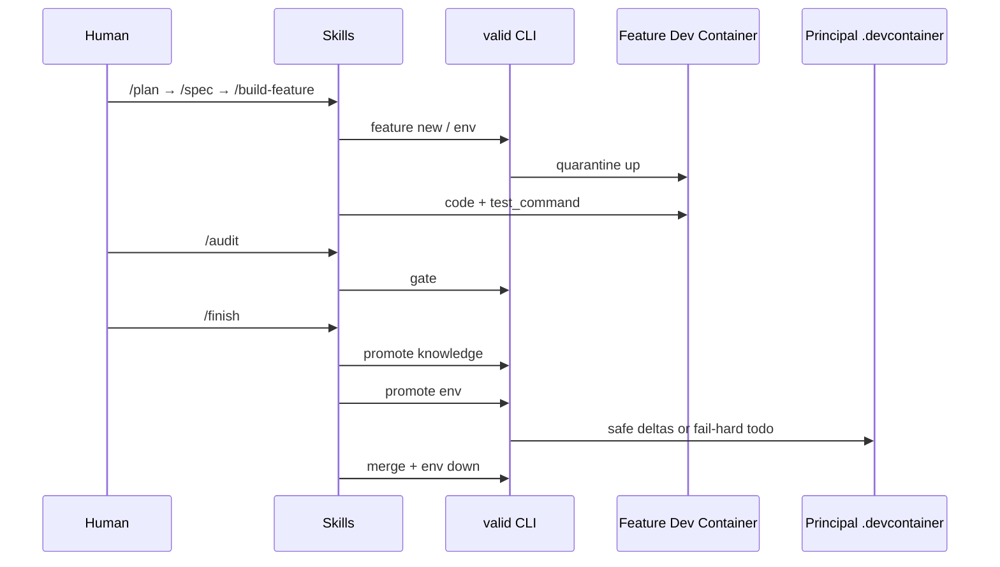
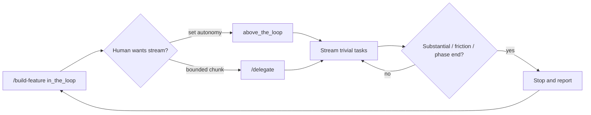

# VALID

**Visual Agentic Loop for Isolated Development**

VALID is a small, **AI-agnostic** toolkit for shipping software features with coding agents — without letting them trash your host, your main Dev Container, or your shared databases.

The **method** lives in Markdown **skills** and **agents**.  
A tiny Go **CLI** does deterministic plumbing (worktrees, quarantine envs, gates, promote, merge).  
A **dashboard** shows how far the AI has actually gotten — board state, not chat vibes.  
Your editor is optional wiring, not the product.

```text
Human → /plan → /spec → /build-feature → /audit → /finish
              ↑                    ↑
         board on disk        valid gate
         + Mermaid            (ACs + real tests)
              ↑
         valid dashboard  ←── visual progress
```

---

## Table of contents

1. [What VALID is (and is not)](#what-valid-is-and-is-not)
2. [Who it is for](#who-it-is-for)
3. [Why AI-agnostic](#why-ai-agnostic)
4. [Problems it solves](#problems-it-solves)
5. [Mental model — four layers](#mental-model--four-layers)
6. [Built on Dev Containers](#built-on-dev-containers)
7. [Directory map](#directory-map)
8. [Lifecycle (plan → finish)](#lifecycle-plan--finish)
9. [The board contract](#the-board-contract)
10. [Dashboard (visual progress)](#dashboard-visual-progress)
11. [Gate — proof of done](#gate--proof-of-done)
12. [Autonomy (in / above the loop)](#autonomy-in--above-the-loop)
13. [Promote, merge, abandon](#promote-merge-abandon)
14. [Requirements](#requirements)
15. [Install the binary](#install-the-binary)
16. [Set up a consumer project](#set-up-a-consumer-project)
17. [Config reference](#config-reference)
18. [Usage flows](#usage-flows)
19. [Dogfooding from another Dev Container](#dogfooding-from-another-dev-container)
20. [How to verify it worked](#how-to-verify-it-worked)
21. [MCP and project scripts](#mcp-and-project-scripts)
22. [IDE packages](#ide-packages)
23. [CLI reference](#cli-reference)
24. [Troubleshooting](#troubleshooting)
25. [FAQ](#faq)
26. [License](#license)

---

## What VALID is (and is not)

| VALID **is** | VALID **is not** |
|--------------|------------------|
| A **repeatable method** (skills you invoke) | A chat plugin that auto-runs itself |
| A **progress contract** on disk (the board) | “Trust me, it’s done” in the transcript |
| **Mechanical gates** (AC coverage + live tests) | Honor-system checkboxes |
| **Quarantine** via git worktree + Dev Containers | A proprietary sandbox runtime |
| **AI-agnostic** plumbing + Markdown | Locked to one model or one IDE |
| Optional Cursor / Claude / OpenCode / Codex adapters | Dependent on those hosts |

If you can run `valid` and open a chat that follows `.valid/skills/`, you can use VALID — even from a plain terminal.

---

## Who it is for

Teams or solo developers who already use AI coding agents and need:

- a **repeatable loop** (plan → spec → build → audit → finish), not a one-off ritual
- **isolation** so experiments do not pollute the machine or the stable project environment
- a **durable contract of progress** the model must keep honest (ACs, tasks, TDD, Mermaid)
- a **visual dashboard** so you can see implementation state without scrolling chat
- **proof of done** that is mechanical, not vibes
- **searchable project knowledge** that survives the chat window
- freedom to **change models and IDEs** without rewriting the workflow

VALID is **meant** to work well inside VS Code and forks such as Cursor — and equally on Claude Code, OpenCode, Codex, or terminal + any agent that reads Markdown and can call a CLI.

---

## Why AI-agnostic

AI tooling churns fast: new models, new IDEs, new “agent” products every month. A workflow that only exists as a proprietary plugin dies when you switch.

VALID keeps the **method and the contract in your repo**:

- skills and agents under `.valid/`
- board JSON + Mermaid per feature
- knowledge corpus under `.valid/knowledge/`

The **CLI** stays boring plumbing. Swap Cursor for Claude Code, or GPT for Claude — the loop stays the same. Packages under `packages/` are thin adapters; `valid install` copies them. **The product is not the adapter.**

---

## Problems it solves

| Problem | Without VALID | With VALID |
|---------|---------------|------------|
| **Host pollution** | Global installs, toolchain upgrades on your daily machine | Feature work in a **quarantined Dev Container** on a git worktree |
| **Shared env drift** | Agents edit the principal `.devcontainer/` before the change is proven | Feature DC only under `.valid/worktrees/<slug>/`; **promote env** is fail-hard |
| **Dirty data stores** | Tests/migrations hit the primary DB | Feature DB **off by default**; optional recipe; isolation warnings |
| **Opaque “done”** | “It works” with no ACs or suite evidence | Dual **gate**: every AC covered by a task **and** `test_command` green |
| **Knowledge amnesia** | Decisions die in chat | Fragmented knowledge + MCP RAG; promote only what clears a high bar |
| **IDE lock-in** | Workflow lives in one plugin | Skills + CLI + optional adapters; terminal-first always works |
| **Autonomous chaos** | Agent streams for an hour and invents scope | Default **in the loop**; optional **above the loop** + **delegate** for bounded chunks |

---

## Mental model — four layers

Do not confuse these:

| Layer | What it is | What it is not |
|-------|------------|----------------|
| **Skill** | Markdown procedure under `.valid/skills/` you invoke in chat (`/plan`, `/build-feature`, …). Orchestrates dialogue, **edits the board**, and decides when to call CLI / MCP / agents. | Not a CLI subcommand. Not auto-run (`disable-model-invocation: true`). |
| **Agent** | Role prompt under `.valid/agents/` (`interviewer`, `developer`, `reviewer`, `delegate`). A skill may invoke it for focused work. | Not the full method by itself. |
| **CLI** (`valid`) | Deterministic scaffolding: feature / worktree / DC, gate, promote, merge, env, dashboard, install. | Does not dialog. There is no product UX of `valid plan` / `valid build`. |
| **MCP** (`valid mcp`) | Knowledge RAG + optional project script tools. | Never mutates boards / TDD / ACs. |

```text
You (human)
  └─► Skill (e.g. /build-feature)
        ├─► Agent role (developer / delegate / …)
        ├─► edits ──► .valid/features/<slug>/   (progress contract)
        ├─► CLI valid …  ──► worktree / DC / gate / promote / merge / dashboard
        └─► MCP tools    ──► .valid/knowledge/** + .valid/scripts/**
```

Open `valid dashboard --feature <slug>` anytime to **see** that progress visually.

---

## Built on Dev Containers

VALID’s isolation story is grounded in the open **[Dev Containers](https://containers.dev/)** ecosystem (Docker + `devcontainer.json`, optionally the [Dev Containers CLI](https://github.com/devcontainers/cli)). We did not invent a parallel “agent sandbox” format.

**Why**

- Teams often **already** have a principal `.devcontainer/` — VALID treats it as sacred and never invents one for you.
- The same JSON / Dockerfile vocabulary humans use day-to-day is what the agent uses in quarantine, so promote-back is reviewable, not magical.

| Layer | Where | Role |
|-------|--------|------|
| **Principal Dev Container** | Project `.devcontainer/` (yours) | Stable daily environment. VALID **never creates** this. `promote env` only merges safe deltas (fail hard on doubt). |
| **Feature quarantine DC** | `.valid/worktrees/<slug>/.devcontainer/` | Ephemeral env for one feature: cloned from the principal when present, otherwise a VALID quarantine template. Container name `valid-<slug>`; ports remapped so they do not steal the principal’s host ports. |
| **Git worktree** | `.valid/worktrees/<slug>/` | Branch `feature/<slug>`, cut from the principal folder’s current branch (`environment.base_branch`). |
| **Docker-outside-of-Docker** | Feature (and ideally principal) DC | Needed to start feature containers **from inside** an already-running Dev Container. |

**Soft by design** if Docker / `devcontainer` CLI is missing: VALID still scaffolds the board and worktree and sets `isolation_warning`. Full quarantine needs Docker + Dev Containers CLI (`@devcontainers/cli`). **Minipatch** deliberately skips worktree/DC for tiny edits (same gates, no quarantine).

**Path contract (multi-agent friendly):** keep Cursor/IDE on the **principal** folder. Agents write product code under `.valid/worktrees/<slug>/` (`CODE_ROOT` from `valid paths <slug>`), and board files under `.valid/features/<slug>/`. You do **not** need to open the worktree as a separate workspace. Dirty product files on the principal tree are finding `code_outside_worktree` (`valid doctor` / `valid gate`). With `isolation.strict: true`, that fails the gate.

So: VALID is a **method + board + plumbing** layer **on top of** Dev Container tech — not a replacement for it.

---

## Directory map

After `valid init` (and creating a feature):

```text
your-project/
├── .devcontainer/                 # PRINCIPAL — yours; VALID never invents this
├── .valid/
│   ├── config.json                # test_command, ports, isolation, database…
│   ├── skills/                    # plan, spec, build-feature, audit, finish, patch, minipatch, delegate
│   ├── agents/                    # interviewer, developer, reviewer, delegate
│   ├── knowledge/                 # RAG corpus (architecture, conventions, decisions…)
│   ├── scripts/                   # optional MCP tools (meta.json + runner)
│   ├── features/<slug>/
│   │   ├── data.json              # THE board (progress contract)
│   │   ├── how-it-works.mmd       # Mermaid (required past plan for feature/patch)
│   │   └── workspace/             # deps-delta, gotchas, env-promote-todo…
│   └── worktrees/<slug>/          # git worktree + feature .devcontainer/ (not minipatch)
├── .cursor/                       # after `valid install cursor` (skills, MCP, rules)
└── valid                          # optional: copied release binary
```

**Cursor / IDE worktrees** under `~/.cursor/worktrees/…` are **not** VALID. Only `.valid/worktrees/<slug>/` is the feature quarantine.

---

## Lifecycle (plan → finish)

Every feature board has a `lifecycle` field. Skills move it forward; the gate and merge respect it.

| Lifecycle | Intent | Typical skill |
|-----------|--------|----------------|
| `plan` | Shape, assumptions, Mermaid mechanism | `/plan` |
| `spec` | Measurable acceptance criteria (`what[]`) | `/spec` |
| `build` | Decisions, tasks/`covers`, TDD in quarantine | `/build-feature`, `/delegate` |
| `audit` | Review + mechanical gate | `/audit` |
| `finish` | Promote → merge → teardown | `/finish` |
| `done` | Merged; board usually deleted | (terminal) |



**Modes** (`feature` | `patch` | `minipatch`) change how much quarantine you get — not whether gates apply.

| Mode | Worktree + feature DC | When |
|------|----------------------|------|
| `feature` | Yes | New / unclear behaviour (canonical) |
| `patch` | Yes | Small but still quarantined |
| `minipatch` | No (`isolation_warning` expected) | Typo-level / obvious tiny fix |

---

## The board contract

The board is the **source of truth**. The LLM edits it with file tools. The dashboard and gate **read** it. Chat is not the status page.

### Paths that matter

| Path | Role |
|------|------|
| `.valid/features/<slug>/data.json` | Machine-readable contract |
| `.valid/features/<slug>/how-it-works.mmd` | Mermaid mechanism drawing (**this** path — not under `workspace/`) |
| `.valid/worktrees/<slug>/` | Where code for the feature lives |

### Canonical JSON shapes (write these)

Wrong shapes make `valid dashboard` / `valid gate` fail to load the board (`Board unloadable`). Prefer these exact keys:

```json
{
  "what": [
    { "id": "ac1", "description": "User can reset password via email link" }
  ],
  "phases": [
    {
      "id": "p1",
      "name": "Core reset flow",
      "outcome": "User receives email link and can set a new password once.",
      "status": "agreed"
    }
  ],
  "tasks": [
    {
      "id": "t1",
      "title": "Add reset token model",
      "status": "pending",
      "phase": "p1",
      "covers": ["ac1"]
    }
  ],
  "decisions": [
    { "id": "D1", "title": "Token TTL", "detail": "15 minutes; single use" }
  ],
  "assumptions": [
    { "id": "A1", "detail": "SMTP already configured in staging. Breaks if wrong: need mailer spike first." }
  ],
  "environment": {
    "isolation_warning": false
  }
}
```

| Field | Type | Notes |
|-------|------|--------|
| `north_star` | string | Outcome of the whole feature |
| `what[]` | `{id, description}` | Acceptance criteria — **not** a string array |
| `phases[]` | `{id, name, outcome, status}` | Array order = sequence; **no** `order` / `title` |
| `phases[].status` | `agreed` \| `pending` \| `doing` \| `done` | Spec writes `agreed` |
| `tasks[]` | `{id, title, status, phase?, covers, description?}` | Dashboard groups by `phase` |
| `tasks[].status` | `pending` \| `doing` \| `done` \| `failed` | Colours: orange / teal / accent / red |
| `tasks[].phase` | string | `phases[].id` when phases exist |
| `tasks[].covers` | string[] | Must reference `what[].id` |
| `decisions[]` | `{id, title, detail?}` | Prefer `title`/`detail`, not `text` |
| `assumptions[]` | `{id, detail}` | Put “breaks if wrong” inside `detail` |
| `autonomy` | `in_the_loop` \| `above_the_loop` | Default `in_the_loop` |
| `environment.isolation_warning` | **boolean** | Not a prose string |
| `environment.base_branch` | string | Branch the worktree was cut from (merge target) |
| `tdd` | aggregates + `cases[]` | Gate live-run replaces suite evidence |
| `how_it_works` / `.mmd` | Mermaid | File on disk wins for the dashboard |

The loader is **somewhat** tolerant of common LLM mistakes (string `what`, `text` on decisions, `title` on phases, stringy `isolation_warning`), but skills and knowledge teach the **canonical** shapes — write those.

### Who writes what

| Actor | Writes | Does not |
|-------|--------|----------|
| **LLM** (via skills) | `data.json`, `.mmd`, code in worktree, knowledge candidates | Invent principal `.devcontainer/` |
| **CLI** | Scaffold board/worktree/DC; gate results; merge/teardown | Dialog / invent ACs |
| **MCP** | Knowledge search / optional scripts | Boards, TDD, ACs |
| **Dashboard** | Nothing (read-only UI) | |

Optional helpers: `valid board`, `valid task`, `valid report` — power users only; prefer editing JSON.

---

## Dashboard (visual progress)

Chat is a terrible status page. The dashboard is the intended way to **watch AI implementation progress**.

```bash
valid dashboard --feature my-feature
# → http://127.0.0.1:7432   (or dashboard_port from config)
```

- Polls `/api/data` about every second (`data.json` + `how-it-works.mmd`).
- Shows lifecycle, autonomy, isolation, ACs, phases, Mermaid, tasks, decisions, assumptions, promotions, tests, gate findings.
- Does **not** start automatically on `init` / `install` / `feature new` — run it when you want the live view.
- Forward port `7432` (or your config port) from the Dev Container if you browse from the host.

If you see **Board unloadable**, `data.json` failed to parse — fix shapes (see [board contract](#the-board-contract)) or `curl -s http://127.0.0.1:7432/api/data` for the error.

Neither the dashboard nor MCP HTTP is a background daemon of `valid install`. MCP over **stdio** is started by the IDE when configured.

---

## Gate — proof of done

```bash
valid gate <slug>
```

By default the gate:

1. Runs `config.test_command` in the **feature worktree** (or repo root for minipatch).
2. Refuses to fall back to the principal tree if the worktree path is missing (hard error).
3. Replaces board TDD suite evidence with the live run result (stale pending/fail cases cannot veto a green suite).
4. Checks AC ↔ task `covers`, Mermaid quality (feature/patch past `plan`), and records `audit` on the board.

| Finding (examples) | Meaning |
|--------------------|---------|
| `ac_uncovered` | An AC id has no task covering it |
| `no_tests` / `tests_not_green` | Suite missing or red |
| `how_it_works_missing` / `_stub` / `_invalid` | Mermaid absent, scaffold stub, or not Mermaid |
| `worktree_missing` | Feature/patch worktree gone or empty path |
| `code_outside_worktree` | Product files dirty on the principal tree (should be under `CODE_ROOT`) |
| `isolation_warning` | Soft (unless `isolation.strict`) — DC down / board flag / contamination side-effect |

`--trust-board` skips executing `test_command` and only inspects board evidence (tests / CI helpers — not the product default for features).

```bash
valid paths <slug>    # CODE_ROOT, BOARD, …
valid doctor <slug>   # path contract + principal contamination scan
```

`isolation.strict: true` in `.valid/config.json` elevates `code_outside_worktree` and `isolation_warning` to **errors** (minipatch exempt).
---

## Autonomy (in / above the loop)

| Mode | Behaviour |
|------|-----------|
| `in_the_loop` (**default**) | Human present on **every** task |
| `above_the_loop` | Stream **trivial** tasks; stop on real decisions, new ACs, secrets, phase boundaries, friction |
| `/delegate` | Skill + `delegate` agent: explicit chunk boundary + stop report; still ends in audit/finish |

```bash
valid board set my-feature --autonomy above_the_loop
valid board set my-feature --autonomy in_the_loop
```

Delegate never skips audit/finish. Autonomy is about **how noisy** build is — not about skipping proof.

---

## Promote, merge, abandon

### Promote knowledge

```bash
valid promote knowledge <slug> [--dry-run]
```

Copies only what clears a high bar into `.valid/knowledge/` (stable, cross-feature, non-obvious). Skills decide *what* is worth promoting; CLI does the copy.

### Promote env (fail-hard)

```bash
valid promote env <slug> [--dry-run]
```

Merges **safe** deltas from the feature Dev Container into the **existing** principal `.devcontainer/`. If the principal is missing, the Dockerfile is opaque, or a change is doubtful → **fail hard**, write `workspace/env-promote-todo.md`, and **do not merge**.

### Merge

```bash
valid merge <slug>
```

Merges `feature/<slug>` into `environment.base_branch` (the branch recorded when the worktree was created — not a hard-coded `main`). Order: **merge first**, then tear down the feature container. Refuses early lifecycles unless `--allow-early`.

### Abandon (“nah, no me mola”)

```bash
valid feature delete <slug>
```

No merge. Tears down container (if any), removes worktree + branch, deletes the board.

| Command | Effect |
|---------|--------|
| `valid feature delete <slug>` | Board + worktree + DC gone |
| `valid feature delete <slug> --keep-env` | Board only |
| `valid env down <slug>` | Container + worktree gone; board kept |

---

## Requirements

| Need | For |
|------|-----|
| **Git** | Always |
| **VALID binary** | Always (`make build` / `make dist` / release artifact) |
| **Go 1.22+** | Only to *compile* VALID from source |
| **Docker** + **Dev Containers CLI** | Full feature quarantine (`env up`) |
| **docker-outside-of-docker** (or Docker socket) in the **principal** DC | Starting feature DCs from inside a Dev Container |
| VS Code / Cursor / Claude / OpenCode / Codex | Optional |

---

## Install the binary

### Build from source (this machine / VALID Dev Container)

```bash
git clone <this-repo>
cd VALID
make build                 # → bin/valid
export PATH="$PWD/bin:$PATH"
valid --help
```

### Cross-compile for distribution

```bash
make dist                  # linux amd64+arm64, windows/amd64, darwin amd64+arm64
# or one target:
make build-linux           # → bin/valid-linux-amd64   (typical Dev Container / WSL)
make build-windows         # → bin/valid-windows-amd64.exe
make build-darwin
```

Attach `bin/valid-*` to a GitHub Release. Consumers copy the matching binary into their project (e.g. `./valid`) — **no compile step**, no global PATH required.

```bash
make clean-bin             # remove built artifacts
```

---

## Set up a consumer project

```bash
cd /path/to/your-project   # must be a git repo
valid init
valid install cursor       # optional: claude | opencode | codex | all
```

1. **`valid init`** — seeds `.valid/` (config, skills, agents, knowledge, scripts). Re-running refreshes skills/agents without wiping your config.
2. **`valid install <ide>`** — publishes skills into that host’s skill tree + MCP / rules. Re-run after upgrading VALID (`--force` to overwrite adapter files).

Then set at least `test_command` in `.valid/config.json` (see [config reference](#config-reference)).

If you want **promote env** later, ensure a principal `.devcontainer/` already exists.

---

## Config reference

`.valid/config.json` (defaults shown conceptually):

```json
{
  "version": 2,
  "test_command": "go test ./...",
  "dashboard_port": 7432,
  "mcp_http_port": 7433,
  "feature_dashboard_port": 0,
  "feature_port_offset": 100,
  "theme": "dark",
  "main_devcontainer": ".devcontainer/devcontainer.json",
  "scripts_root": ".valid/scripts",
  "language": "repo",
  "isolation": { "strict": false },
  "database": { "enabled": false, "recipe": "" },
  "mcp": { "knowledge_root": ".valid/knowledge" }
}
```

| Key | Meaning |
|-----|---------|
| `test_command` | Suite command; **`valid gate` executes it** |
| `dashboard_port` | `valid dashboard` listen port (loopback) |
| `mcp_http_port` | `valid mcp --http` |
| `feature_dashboard_port` | Base for feature DC host ports; `0` → `dashboard_port + feature_port_offset` (+ slug salt) |
| `feature_port_offset` | Offset used when auto-deriving feature ports |
| `theme` | Dashboard UI: `dark` (default) or `light` |
| `main_devcontainer` | Principal DC JSON path (never invented) |
| `scripts_root` | MCP script nodes |
| `language` | Board prose: `repo` = match the repository language, or `en` / `es` / … |
| `isolation.strict` | If `true`, `code_outside_worktree` and `isolation_warning` **fail** the gate / doctor (minipatch exempt) |
| `database.enabled` | Default `false` — do not use the principal DSN from feature work |
| `database.recipe` | How to start an ephemeral DB for features |
| `mcp.knowledge_root` | Knowledge corpus root |

---

## Usage flows

Skills are **manual**. Invoke them explicitly (e.g. `/plan`). The model will not auto-pick them.

### Flow map

```mermaid
flowchart TD
  init[valid init + optional install] --> choose{Change size?}
  choose -->|full feature| plan["/plan"]
  choose -->|known small + quarantine| patch["/patch"]
  choose -->|tiny / no isolation| minipatch["/minipatch"]
  plan --> spec["/spec"]
  spec --> build[ "/build-feature"]
  patch --> build
  minipatch --> build
  build --> maybeDel{Need autonomy chunk?}
  maybeDel -->|yes| dele["/delegate"]
  maybeDel -->|no| audit
  dele --> build
  build --> audit["/audit + valid gate"]
  audit -->|fail| build
  audit -->|pass| finish["/finish"]
  finish --> done[Merged + board gone + env down]
```

### A — Day zero (once per repo)

```bash
cd /path/to/your-project
valid init
valid install cursor          # optional
# edit .valid/config.json → test_command
# ensure principal .devcontainer/ exists if you want promote env later
```

Open chat and follow skills under `.valid/skills/` (or the IDE copies from `valid install`).

### B — Full feature (canonical)

Goal: new behaviour with quarantine, ACs, TDD, review, promote, merge.

| Step | You invoke | What happens |
|------|------------|--------------|
| 1 | `/plan my-feature` | Interview → Mermaid → `valid feature new` → worktree + feature DC. Board at `.valid/features/my-feature/`. |
| 2 | `/spec` | Measurable `what[]` + optional `phases[]` (`interviewer`). |
| 3 | `/build-feature` | Decisions + tasks with `covers` → TDD in quarantine (`developer`). Default `in_the_loop`. |
| 3b | `/delegate` (optional) | Bounded chunk with `above_the_loop`. Same gates. |
| 4 | `/audit` | `reviewer` + `valid gate`. Fix and re-audit if red. |
| 5 | `/finish` | Promote knowledge (sparingly) → fail-hard promote env → merge into recorded base branch → delete board → tear down env. |

**Same path by hand** (skills normally call these):

```bash
valid feature new my-feature --north-star "Users can reset password"
# agent edits data.json + how-it-works.mmd + code under .valid/worktrees/my-feature/
valid dashboard --feature my-feature
valid gate my-feature
valid promote knowledge my-feature
valid promote env my-feature
valid merge my-feature
```

**Abort rule on finish:** if `promote env` fails → **do not** merge and **do not** delete the board. Fix `workspace/env-promote-todo.md` and re-run.



### C — Patch (small change, still quarantined)

Use when there **is** precedent in code, scope is small, but you still want worktree + DC.

1. `/patch <slug>` — short `what[]` / tasks, then same build → audit → finish discipline.
2. Same gates: AC coverage + green tests. No “it’s tiny” escape hatch.

### D — Minipatch (tiny change, no quarantine)

Use for typo-level / obvious one-file fixes when isolation is overkill.

1. `/minipatch <slug>` — board only; **no** worktree/DC (`isolation_warning` expected).
2. Still: ACs, tasks/`covers`, `valid gate`.
3. Commit on the current branch; no `valid merge`. Delete the board when done (`valid feature delete`).

### E — Above the loop / delegate



Rules: stream **trivial** work only; stop on architecture, new ACs, secrets, failing suite you cannot fix inside the chunk.

### F — Knowledge + scripts during work

```bash
valid mcp                 # stdio — IDE install points here
# In chat: search_knowledge / get_document / upsert_document
# Plus tools from .valid/scripts/<id>/meta.json
```

HTTP (loopback + token; scripts off by default on HTTP):

```bash
export VALID_MCP_TOKEN='long-random-secret'
valid mcp --http --addr 127.0.0.1:7433
```

### G — Which flow should I pick?

| Situation | Flow |
|-----------|------|
| New feature / unclear shape | **B — Full feature** |
| Small change, want isolation | **C — Patch** |
| Tiny fix, isolation optional | **D — Minipatch** |
| Tired of confirming every trivial task | **E — Delegate / above_the_loop** (still finish with audit) |
| Env delta proved in quarantine | Stay on **B**; let `/finish` promote env (or fail-hard) |
| Started a feature and want it gone | **H — Abandon** |

### H — Abandon a feature

```bash
valid feature delete <slug>
```

See [Promote, merge, abandon](#promote-merge-abandon).

---

## Dogfooding from another Dev Container

Each Dev Container only sees **its** workspace. Putting VALID on `PATH` inside the VALID repo does not help the other project.

**Recommended:** copy a release / cross-compiled binary into the consumer repo:

```bash
# in VALID
make build-linux    # or make dist
cp bin/valid-linux-amd64 /path/to/other-project/valid

# in the other project container
chmod +x ./valid
./valid init
./valid install cursor
./valid feature new demo --north-star "…"
./valid dashboard --feature demo
```

For feature quarantine **from inside** that project’s DC you typically need:

1. `docker-outside-of-docker` (or Docker socket) in the **principal** `.devcontainer/`
2. `devcontainer` CLI on PATH (`npm i -g @devcontainers/cli`)
3. Then `./valid env up <slug>` — the real error prints here (unlike a soft warning on `feature new`)

SSH for `git@…` remotes: mount host `~/.ssh` into the Dev Container (read-only is fine).

---

## How to verify it worked

```bash
# Board exists
ls .valid/features/<slug>/
./valid board show <slug>

# Worktree exists (feature/patch)
ls .valid/worktrees/<slug>/
git worktree list
# expect: .../.valid/worktrees/<slug>  ... [feature/<slug>]

# Dashboard loads board (not "Board unloadable")
./valid dashboard --feature <slug>
curl -s http://127.0.0.1:7432/api/data | head

# Gate can at least load + run policy
./valid gate <slug>
```

Ignore Cursor’s `~/.cursor/worktrees/…` entries (often `prunable`) — those are IDE agent sandboxes, not VALID.

---

## MCP and project scripts

MCP is for **knowledge RAG** and optional **project scripts**. It must never fake TDD or ACs.

Each folder with `meta.json` under `.valid/scripts/` becomes a tool:

```text
.valid/scripts/seed_db/
  meta.json
  run.sh
```

```json
{
  "description": "Seed local DB with fixtures.",
  "command": ["bash", "run.sh"],
  "timeout_sec": 120,
  "cwd": "script",
  "enabled": true
}
```

After `valid install cursor`, Cursor starts `valid mcp` over **stdio** when the MCP server is enabled. The adapter uses command `valid` — ensure the binary is on PATH **or** edit `.cursor/mcp.json` to point at `./valid`.

Reconnect MCP after adding tools.

---

## IDE packages

Thin adapters only. Prefer `valid install`.

| Package | Wiring |
|---------|--------|
| [`packages/cursor`](packages/cursor/) | `.cursor/mcp.json`, rules, skills/, agents/ |
| [`packages/claude-code`](packages/claude-code/) | MCP + `CLAUDE.md` + skills |
| [`packages/opencode`](packages/opencode/) | Config fragment + skills |
| [`packages/codex`](packages/codex/) | MCP TOML + `AGENTS.md` |

```bash
valid install cursor --force
make sync-ide    # when developing VALID itself: packages → embed assets
```

---

## CLI reference

Plumbing only — **not** the method UX. Method UX is skills (`/plan`, `/spec`, …).

```text
valid init
valid install [cursor|claude|opencode|codex|all] [--force] [--link]

valid feature new <slug> [--mode feature|patch|minipatch] [--north-star …] [--no-env]
valid feature delete <slug> [--keep-env]

valid gate <slug> [--trust-board]
valid doctor <slug>               # path contract + principal contamination
valid paths <slug>                # print CODE_ROOT / BOARD / …
valid promote knowledge|env <slug> [--dry-run]
valid merge <slug> [--skip-gate] [--allow-early] [--allow-current-head]
valid env up|down <slug>

valid dashboard --feature <slug> [--port N]
valid mcp [--http] [--addr 127.0.0.1:7433] [--allow-scripts-http]

valid board set|show <slug> [--autonomy in_the_loop|above_the_loop] …
valid task <slug> <id> …          # optional helper
valid report <slug> …             # optional helper

valid --repo <path> …             # override git root discovery
```

| Command | One-liner |
|---------|-----------|
| `init` | Seed `.valid/` |
| `install` | Wire IDE adapters + refresh skills |
| `feature new` | Board + (usually) worktree/DC |
| `feature delete` | Abandon — no merge |
| `gate` | AC coverage + execute `test_command` + isolation scan |
| `doctor` | Path contract + principal contamination (`code_outside_worktree`) |
| `paths` | Print `CODE_ROOT` / `BOARD` / … for agents |
| `promote knowledge` | High-bar knowledge copy |
| `promote env` | Fail-hard merge into principal DC |
| `merge` | Merge feature branch → tear down env |
| `env up/down` | Start / stop feature DC (+ down removes worktree) |
| `dashboard` | Visual board UI |
| `mcp` | Knowledge + scripts |

---

## Troubleshooting

| Symptom | Likely cause | What to do |
|---------|--------------|------------|
| `Board unloadable` / parse error on `what` | LLM wrote string arrays / wrong keys | Fix shapes ([board contract](#the-board-contract)); upgrade binary (tolerant loader); `curl` `/api/data` |
| Dashboard empty / only errors | Same as above, or wrong `--feature` | Check slug; fix `data.json` |
| Mermaid missing in UI | File under `workspace/` instead of feature root | Put diagram in `.valid/features/<slug>/how-it-works.mmd` |
| `isolation_warning` after `feature new` | `devcontainer up` failed or CLI missing | `valid env up <slug>` to see the real error; install `@devcontainers/cli` + Docker-in-DC |
| Gate `code_outside_worktree` | Product files dirty on principal | Move edits into `CODE_ROOT` (`valid paths`); clean principal; `valid doctor <slug>` |
| Gate `worktree_missing` | Worktree deleted / path wrong | Restore worktree or abandon/recreate feature |
| Gate `no_tests` / `tests_not_green` | Suite not run or red | Fix tests; re-run `/audit` |
| Gate `ac_uncovered` | AC without `tasks[].covers` | Add/fix tasks on the board |
| Gate `how_it_works_*` | Missing/stub Mermaid | Author a real diagram in `how-it-works.mmd` |
| Promote env fail-hard | No principal DC / opaque delta / conflict | Read `workspace/env-promote-todo.md`; **no merge yet** |
| Merge refused (lifecycle) | Still in `plan`/`spec`/`build` | Finish audit, or `--allow-early` (dangerous) |
| Merge refused (empty `base_branch`) | Board missing cut-from branch | Fix board or `--allow-current-head` |
| Skills missing in IDE | Install not run / stale cache | `valid install <ide> --force`; reload window / MCP |
| MCP server won’t start | `valid` not on PATH | Point `.cursor/mcp.json` at `./valid` or install binary on PATH |
| `git@github.com` Permission denied | No SSH keys in the container | Mount host `~/.ssh` read-only in `devcontainer.json` |
| Orphan `valid-<slug>` container | Interrupted finish | `valid env down <slug>` or `docker rm -f valid-<slug>` |
| Extra entries in `git worktree list` | Cursor agent worktrees | `git worktree prune`; ignore unless you care |
| Want to drop a started feature | Changed mind | `valid feature delete <slug>` |

---

## FAQ

**Do I need Cursor?**  
No. Any agent that can follow `.valid/skills/` and call `valid` works.

**Does `valid install` start the dashboard?**  
No. Run `valid dashboard --feature <slug>` when you want it. MCP stdio is started by the IDE.

**Is soft isolation a failure?**  
No. It means quarantine DC did not come up (or you chose minipatch). Gates still apply; prefer fixing `env up` for real features.

**Where should the agent write code?**  
In `.valid/worktrees/<slug>/` for feature/patch. Not casually in the principal tree.

**Can I use VALID without Docker?**  
Yes for board + minipatch + gate against `test_command`. Full feature quarantine needs Docker + Dev Containers.

**Does VALID create my principal Dev Container?**  
Never. `promote env` only merges into an existing one, or fails hard.

**Skills vs CLI?**  
Skills = method UX (dialogue + board edits). CLI = scaffolding and mechanical proof. There is no `valid plan` product command.

---

## License

MIT License — see [`LICENSE`](LICENSE).
